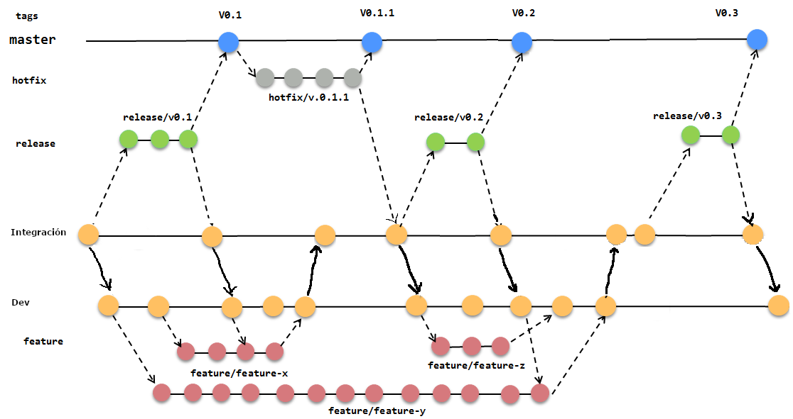
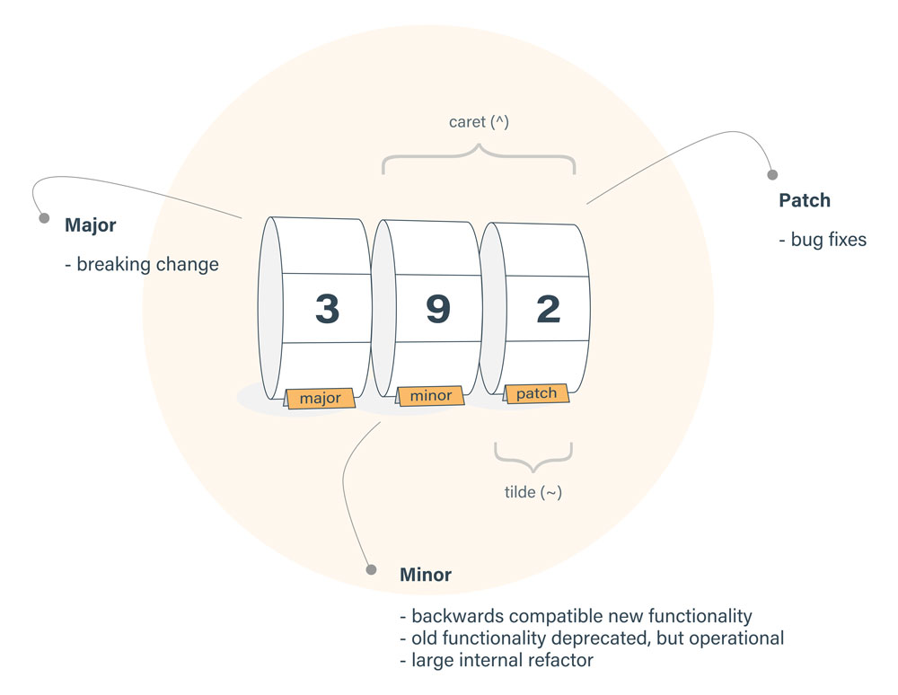
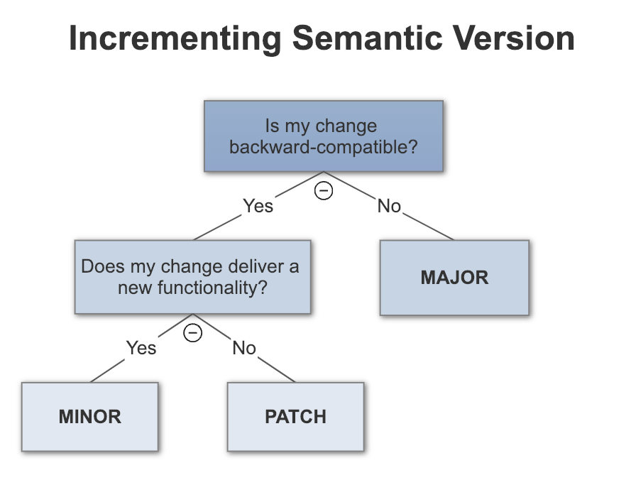
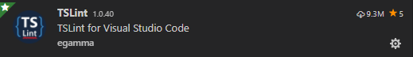
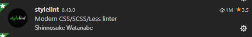

# NGZ Naranja

 NGZ es una libreria que suministra un set de componentes de angular, para ser re utilizado en varios de nuestros proyectos.

## Tabla de contenidos

- [Demo](#demo)
  - [Publica](#link-publico)
  - [Local](#ejecutar-demo-local)
- [Entorno](#Entorno)
- [Dependencias](#Dependencias)
- [Instalacion](#Instalacion)
- [Browsers soportados](#browser-soportados)
- [Desarrollo](#Desarrollo)
  - [Gitflow](#gitflow)
  - [Como hacer un commit](#como-hacer-un-commit)
  - [Creando un componente](#creando-un-componente)
- [Linters](#linters)
- [Testing](#testing)
- [Building](#building)
- [IDE: Vscode](#vscode-plugins)
- [Publicar](#publicar)


## Demo

### Link publico

  Ver la libreria [demo](http://localhost:4200)

### Ejecutar demo local

Este repo contiene en si mismo una demo de los componentes, con solo ejecutar un:

```bash
$ ng serve --open # se abrira el browser con la demo corriendo
```

## Entorno

  - [nodejs](https://nodejs.org/) (testeado con 8.12.0)
  - [npm](https://www.npmjs.com) (version 5.4 o superior)

## Dependencias

 [Angular](https://angular.io) (v6)

## Instalacion

NGZ esta disponible en un NPM privado de Naranaja, antes de instalar esta libreria, debemos estar seguro de tener acceso al repositorio.
Checkear el siguiente link  [configurar npm privado](https://naranja.atlassian.net/wiki/spaces/CED/pages/58163274/SFUT-Arquitectura).

Para instalar la libreria, ejecutar en la linea de comandos:

```bash
$ npm install zumo --save
```

y en tu Angular `ShareModule`:

```typescript
// Importar el module
import { ZumoModule } from 'zumo';

@NgModule({
  imports: [
    BrowserModule,

    // y agregarlo
    ZumoModule
  ]
})
export class SharedModule { }
```

Una vez agregada la libreria, puedes usar los componentes, directivas y pipes en tu aplicacion, como por ejemplo:

```xml
<z-loading type="secondary" size="small" withBg="true"></z-loading>
```

## Browser soportados

Como base estamos usando flexbox para las css, pueden ver la especificacion [browsers](https://caniuse.com/#search=flexbox)


## Desarrollo

Antes de empezar a contribuir asegurate que tienes instalado lo comentado en el apartado [Environment](#environment)

### Gitflow 


### Como hacer un commit 



#### Documentación asociada:
  - https://github.com/angular/angular/blob/master/CONTRIBUTING.md
  - Commit lint: https://github.com/conventional-changelog/commitlint/tree/master/@commitlint/config-angular
  - https://codete.com/blog/versioning-with-semver-and-conventional-commits/
  - https://bytearcher.com/goodies/semantic-versioning-cheatsheet/

#### Commit tipos (usar algunos de estos)

* **build**: Cambios que afectan el sistema de compilación o las dependencias externas (ámbitos de ejemplo: trago, brócoli, npm)
* **ci**: Cambios en nuestros archivos de configuración y scripts de CI (ámbitos de ejemplo: Circle, BrowserStack, SauceLabs)
* **docs**: Cambios en la doc
* **feat**: Una nueva funcionalidad
* **fix**: Un fix de un bug
* **perf**: Un cambio de código que mejora el rendimiento.
* **refactor**: Un cambio de código que no corrige un error ni agrega una característica
* **style**: Cambios que no afectan el significado del código (espacios en blanco, formato, puntos y comas que faltan, etc.)
* **test**: Agregar test faltantes o corregir test existentes
* **revert**: Un revert de un commit

_patches:_

```sh
git commit -a -m "fix: ZDS-XXX se arregla el problema xxx"
```

_features:_

```sh
git commit -a -m "feat: ZDS-XXX se implementa xxx"
```

_breaking changes:_

```sh
git commit -a -m "feat: ZDS-XXX se introducen nuevos cambios
BREAKING CHANGE: el servicio no soporta mas el método xxx"
```

_other changes:_

Otros: 'build', 'ci', 'docs', 'feat', 'fix', 'perf', 'refactor', 'revert', 'style', 'test'


```sh
git commit -a -m "docs: ZDS-XXX fixed up the docs a bit"
```

### Creando un componente

Para crear un nuevo componente en la libreria seguir los siguentes pasos:

1 - Crear una nueva carpeta con un nombre representativo en `src/lib`, ej.: `hello-world`.

2 - Agregar la siguente esctructura de arhivos :

- hello-world.component.ts
- hello-world.component.html
- hello-world.component.scss
- hello-world.module.ts
- hello-world.component.spec.ts

3 - Aqui ya tienes tu componente, recuerda que todo componente tiene que tener su unit test.

`src/hello-world/hello-world.component.ts`

```typescript
import { Component, OnInit, Input } from '@angular/core';

@Component({
  selector: 'z-hello-world',
  templateUrl: './hello-world.component.html',
  styleUrls: ['./hello-world.component.scss']
})
export class HelloWorldComponent implements OnInit {

  @Input() name: string;

  constructor() { }

  ngOnInit() { }
}

```

`src/hello-world/hello-world.component.html`

```html
<p class="component-hello-text">
  Hello {{name}}!!
</p>
```

`src/hello-world/hello-world.component.scss`

Todos los estilos deberia estar separados en archivos scss

```css
// Esto importa los colores, para que puedan usarse.

@import "../styles/colors";

.component-hello-text {
  color: $color-brand-500;
}
```

`src/hello-world/hello-world.component.spec.ts`

```typescript
import { async, ComponentFixture, TestBed } from '@angular/core/testing';
import { HelloWorldComponent } from './hello-world.component';

describe('HelloWorldComponent', () => {
  let component: HelloWorldComponent;
  let fixture: ComponentFixture<HelloWorldComponent>;

  beforeEach(async(() => {
    TestBed.configureTestingModule({
      declarations: [ HelloWorldComponent ]
    })
    .compileComponents();
  }));

  beforeEach(() => {
    fixture = TestBed.createComponent(HelloWorldComponent);
    component = fixture.componentInstance;
    fixture.detectChanges();
  });

  it('should be created', () => {
    expect(component).toBeTruthy();
  });
});
```

`src/hello-world/hello-world.module.ts`

```typescript
import { NgModule, ModuleWithProviders } from '@angular/core';
import { CommonModule } from '@angular/common';
import { HelloWorldComponent } from './hello-world.component';

export * from './hello-world.component';

@NgModule({
  imports: [
    CommonModule
  ],
  declarations: [
    HelloWorldComponent
  ],
  exports: [
    HelloWorldComponent
  ]
})
export class HelloWorldModule {}
```

4 - Actualizar la libreria para exportar este nuevo componete

`src/common.ts`

```typescript
...
// import the new component module
import { HelloWorldModule } from './hello-world/hello-world.module';

const MODULES = [
  ..
  HelloWorldModule
];
...
```

5 - Ahora estas listo para distribuir este nuevo componente

### Linters

El lenguaje de desarrollo es TypeScript, para ejecutar el lint:
- doc: https://github.com/paolocarrasco/javascript-style-guide

```bash
$ npm run lint
```

### Testing

Para correr la suite de test y que genere ademas el coverage:
```bash
$ npm run test:build
```

Por conveccion de arquitectura hemos tomado como base 80% de coverage.

Para correr los test en modo debug, ejecutar el siguiente comando y el browser quedara abierto.

```bash
$ npm run test
```

Los test son ejecutados via [Karma](https://karma-runner.github.io) y podemos escribirlos con [Jasmine](https://jasmine.github.io/).


### Building

Para generar un build

```bash
$ npm run build
```

### Vscode Plugins
Recomendamos el desarrollo con el IDE [Vscode](https://code.visualstudio.com/)

Y los plugins que recomendamos tener son:

- Linters
  - typescript
  
  - Stylelint
  

### Publicar

Para publicar una version nueva de la libreria, primero asegurar que se ha generado un package correcto.

```bash
$ npm run build:lib
# esto lo hace el pipeline en stage deploy_npm
$ npm publish dist/zumo 
```

## Licencia

Copyright (c) 2018 Naranja.  All rights reserved.
