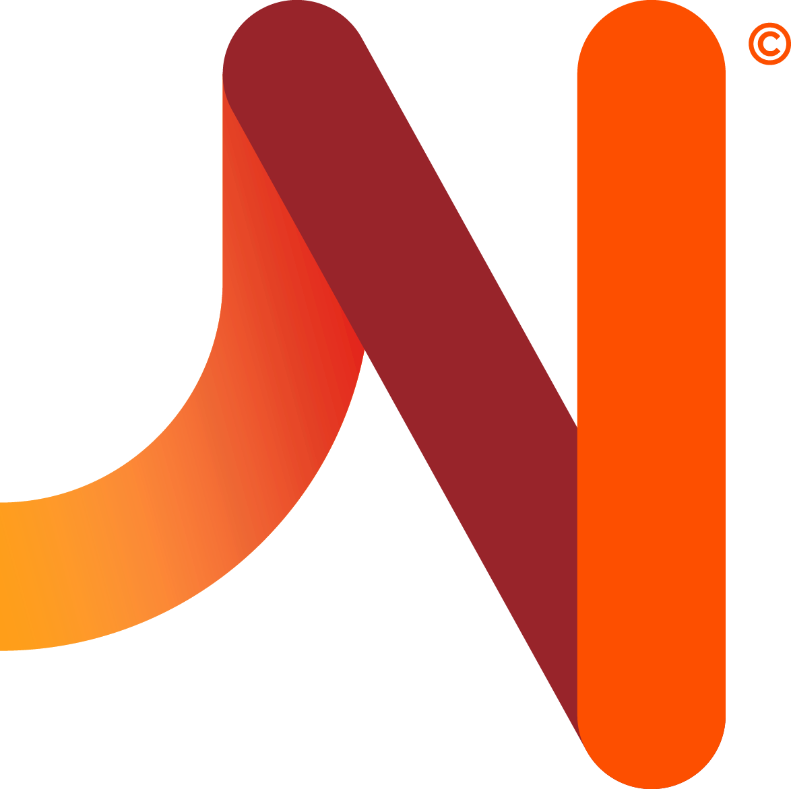

```html
<div class="imagen"></div>
<div [class]="idTypeRouter"></div>
  <div class="box-border">
    <z-card id="noHover" [clickable]="false">
      <div class="icon" (click)="close()">
        <i class="icon-cross size-24"></i>
      </div>
      <div class="row margin-bottom-24">
        <z-container-icon [size]="'extra-large'" [iconName]="icon"></z-container-icon>
      </div>
      <h1 class="z-title margin-top-8 margin-bottom-8">{{title}}</h1>
      <p class="z-body-text margin-bottom-32">{{text}}</p>
        <z-button text={{textButton}}></z-button>
    </z-card>
  </div>

```
```typescript
import { Component, OnInit } from '@angular/core';

export const FeedbackPageType = {
  SUCCESS: 'success',
  WARNING: 'warning',
  ERROR: 'error'
};

const FeedbackPageTypeStyleMapping = new Map<string, string>();
FeedbackPageTypeStyleMapping.set(FeedbackPageType.SUCCESS, 'success');
FeedbackPageTypeStyleMapping.set(FeedbackPageType.WARNING, 'warning');
FeedbackPageTypeStyleMapping.set(FeedbackPageType.ERROR, 'error');

export class FeedbackPageComponent implements OnInit {

  title: string;
   text: string;
   textButton: string;
   icon: string;
 
   typeFeedbackPageClass = FeedbackPageTypeStyleMapping.get(FeedbackPageType.SUCCESS);
   idTypeRouter: string;
 
   ngOnInit() {
     this.loadComponent(this.idTypeRouter);
   }
 
   loadComponent(type: string): void {
     switch (type) {
       case FeedbackPageType.SUCCESS: {
         this.typeFeedbackPageClass = FeedbackPageTypeStyleMapping.get(FeedbackPageType.SUCCESS);
         this.title = '¡Tu préstamo fue aprobado!';
         this.text = 'Te mandamos pasos a seguir por mail a eduardogold@gmail.com. ' +
           'También podés consultar tus dudas desde el administrador de préstamos.';
         this.textButton = 'Ir al administrador';
         this.icon = 'icon-check';
         break;
       }
       case FeedbackPageType.WARNING: {
         this.typeFeedbackPageClass = FeedbackPageTypeStyleMapping.get(FeedbackPageType.WARNING);
         this.title = 'Ya casi terminás';
         this.text = 'Para acreditar la recarga, apoyá tu tarjeta en la Terminal Automática SUBE más cercana.';
         this.textButton = 'Buscar una terminal';
         this.icon = 'icon-message';
         break;
       }
       case FeedbackPageType.ERROR: {
         this.typeFeedbackPageClass = FeedbackPageTypeStyleMapping.get(FeedbackPageType.ERROR);
         this.title = 'Ups! Puede fallar';
         this.text = 'Ocurrió un problema y no pudimos continuar con lo que estabas haciendo.';
         this.textButton = 'Reintentar';
         this.icon = 'icon-cross';
         break;
       }
       default: {
         this.typeFeedbackPageClass = FeedbackPageTypeStyleMapping.get(FeedbackPageType.SUCCESS);
         this.title = '¡Tu préstamo fue aprobado!';
         this.text = 'Te mandamos pasos a seguir por mail a eduardogold@gmail.com. ' +
           'También podés consultar tus dudas desde el administrador de préstamos.';
         this.textButton = 'Ir al administrador';
         this.icon = 'icon-check';
       }
     }
   }
 
   close() {
     window.close();
   }
}
```
```scss
.box-border {
  border-width: 0;
  max-width: 720px;
  text-align: center;
}

.success {
  background-color: $color-success-500;
  height: 240px;
  position: fixed;
  width: 100%;
}

.warning {
  background-color: $color-warning-500;
  height: 240px;
  position: fixed;
  width: 100%;
}

.error {
  background-color: $color-error-500;
  height: 240px;
  position: fixed;
  width: 100%;
}

.icon {
  display: none;
}

:host {
  &::ng-deep #noHover > .z-card:hover {
    box-shadow: 0 1px 4px 0 rgba(0, 0, 0, 0.2), 0 2px 4px 0 rgba(0, 0, 0, 0.04);
  }

  &::ng-deep .z-card {
    padding: $space-64 88px $space-80!important;
    position: absolute!important;
    top: 114px;
    left: 0;
    right: 0;
    margin: auto;
    max-width: 720px;
  }
}

@media screen and (max-width: $screen-s-min) {

  .success {
    background-color: $color-grayscale-100;
    height: 240px;
    padding-top: $space-40;
  }

  .warning {
    background-color: $color-grayscale-100;
    height: 240px;
    padding-top: $space-40;
  }

  .error {
    background-color: $color-grayscale-100;
    height: 240px;
    padding-top: $space-40;
  }

  .icon {
    display: flex;
    justify-content: flex-end;
    padding: 12px;
    position: fixed;
    right: 12px;
    top: 12px;
  }

  .box-border {
    padding: 0;
  }

  .logo {
    display: none;
  }

  .z-title {
    margin-top: 0;
  }
  :host {
    &::ng-deep #noHover > .z-card:hover {
      box-shadow: 0 0 0;
    }

      &::ng-deep .z-card {
        box-shadow: 0 0 0 0 rgba(0, 0, 0, 0) !important;
        padding: $space-24 $space-32 !important;

      }
    }
}

.logo {
  padding: 20px 0 20px 150px;
  width: 30px;
}

.row{
  display: inline-flex;
}
```
