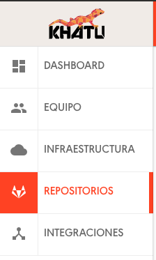
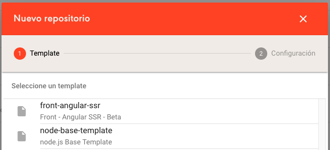
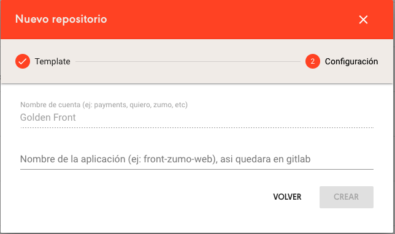
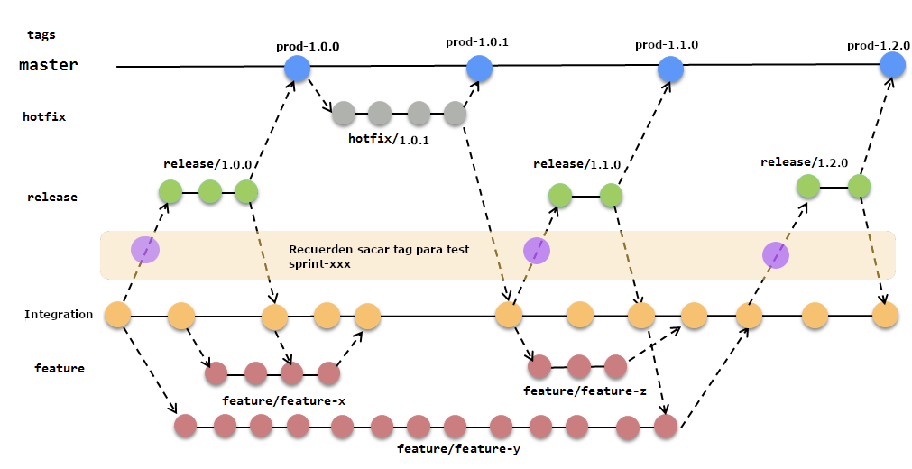

# Estructura del proyecto 
- [Core](./docs/core/core.md)
- [Pages y Features](./docs/pages/pages.md)
- [Shared](./docs/shared/shared.md)

## Tabla de contenidos

- [Crear mi proyecto](#crear-mi-proyecto)
- [Demo](#demo)
  - [Pública](#link-público)
  - [Local](#ejecutar-demo-local)
- [Entorno](#entorno)
- [Instalación](#instalación)
- [Desarrollo](#desarrollo)
  - [Entornos de Angular](#entornos-de-angular)
  - [Gitflow](#gitflow)
    - [Pasos](#Pasos)
  - [Actualizar NPM](#Actualizar-npm)
    - [Git commit](#Git-commit)
      - [Tipologías aceptadas](#Tipologías-aceptadas)
  - [Redux](#redux)
    - [Ver documentación](#ver-documentacion-redux)
  - [PWA](#pwa)
    - [Ver documentación](#ver-documentacion-pwa)
  - [Contentful](#contentful)
    - [Ver documentación](#ver-documentacion-contentful)
  - [Utilidades de desarrollo](#utilidades-de-desarrollo)
    - [Lint](#lint)
    - [Testing](#testing)

## Crear mi proyecto
  1) Ingresar a khatu.naranja.com
  
  2) Seleccionar Repositorios en el menu
      > 
 
  3) Luego hacemos click en el boton "crear repositorio"
      > 

  4) Luego seleccionamos el template del front que necesitemos
      > 

  5) Y por ultimo completamos los datos que nos va pidiendo
      > 

  > Nota: Si no tenemos acceso a khatu, solicita èl mismo a Ezequiel Soler (slack: #EzeSoler)

## Demo

### Pública

- link eks aws naranja
  - https://template-angularssr.dev.goldenfront.us-east-1.awsnaranja.com/
  - https://template-angularssr.tst.goldenfront.us-east-1.awsnaranja.com/

### Ejecutar demo local

Para correr la demo local solamente hay que ejecutar lo siguiente:

```bash
$ ng serve --open # se abrirá el browser con la demo
```

---

## Entorno

- [nodejs](https://nodejs.org/) (testeado con 8.16.0 - lts/carbon)
- [npm](https://www.npmjs.com) (version 6.4.1 o superior)
- [angular](https://angular.io/) (version 7.2)
- [angular-universal](https://angular.io/guide/universal)
- [workbox](https://developers.google.com/web/tools/workbox/) (version 4.3)
- [zumo](https://web.tst.zumo.us-east-1.awsnaranja.com/)

---

## Instalación

Luego de generar el entorno mediante khatu, ejecutar los siguientes comandos.

```bash
$ npm install
$ ng serve  (pueden cambiar de entorno usando -c develop|testing|prodblue|staging)
```

---

## Desarrollo

### Entornos de Angular
  - **stubs**: este entorno es para mockear respuestas, la idea es tener todo funcional sin depender del bff.
    > para levantar el entorno localmente:
    ```git
    $ npm run start:stubs
    ```
  - **proxy**: este entorno sirve para hacer bypass entre los diferentes entornos (develop|testing|staging|prodblue) como también si lo tenemos localmente corriendo.
    > para levantar el entorno localmente:
    ```git
    $ npm run start:proxy
    ```
    > En la exposición de APIGW el base path tiene este patron /**bff-\<cuenta\>-web**. Entonces 
    en tu archivo proxy.conf.json deberiamos reemplazar el nombre de cuenta, como por ej:

    BFF - Interno - osea cuando lo corremos localmente a la golden API.
    ```json
    {
      "/bff-insurance-web/*": {
        "target": "http://localhost:3000",
        "secure": false,
        "changeOrigin": false,   // esto le indica que corre en tu maquina
        "logLevel": "debug",
        "pathRewrite": {
          "^/bff-insurance-web": ""
        }
      }
    }
    ```
    BFF - Externo - En AWS o otro dominio
    ```json
    {
      "/bff-insurance-web/*": {
        "target": "https://services.prd.insurance.us-east-1.awsnaranja.com",
        "secure": false,
        "changeOrigin": true,   // esto le indica que es externo, no necesita rewrite
        "logLevel": "debug"
      }
     }
    ```
  - **develop**: entorno de aws de desarrollo (antes se llamaba desa)
  - **testing**: entorno de aws de desarrollo (antes se llamaba test)
  - **staging**: entorno de aws de desarrollo (antes se llamaba homo)
  - **prodblue**: entorno de aws de desarrollo (antes se llamaba prod)

    > Docs: 
    - https://medium.com/javascript-comunidad/configurar-proxy-en-angular-cli-25f07237d13e
    
### Procedimiento de despliegues:


 https://naranja.atlassian.net/wiki/spaces/AR/pages/265912336/WIP+Procedimiento+de+despliegues+.+WIRU2.0+.

### Gitflow
#### Pasos:

- En el branch de integration

```git
$ git flow release start 1.0.0   --> ejemplo de version
```

- El comando anterior crea el branch release, en este branch podemos seguir haciendo commit para ultimar detalles. Y lo publicamos, para que este disponible para el equipo.

```git
$ git flow release publish 1.0.0   --> ejemplo de version
```

- Cuando este listo para mergear a master y siendo el ultimo commit en la rama de release ejecutar un _npm run release:<tipologia>_

```git
$ npm run release:minor    --> ejemplo de version
```

- Y por último ejecutar un:

```git
$ git flow release finish '1.0.0'   --> ejemplo de version
```

### Actualizar NPM
#### Salidas a producción y trazabilidad de commits:
 
> Release Major:

```bash
$ npm run release:major
```

> Release Minor:

```bash
$ npm run release:minor
```

> Release patch:

```bash
$ npm run release:patch
```

> Beta:

```bash
$ npm run release:beta
```

### Git commit

> Para realizar un commit es recomendable asociar un tipo de contenido a ser subido, el mismo nos ayudará a dar más trazabilidad en el changelog. 

El funcionamiento es bastante sencillo, sólo tenemos que agregarle al commit tradicional algunas de las tipologias (feat, fix...) como parte del prefix del mensaje. 

Es recomendable que el primer commit que hagas sobre tu branch tenga el número de jira, es decir, en donde dice **jira short name-XXX** debería ser remplazado por el nombre corto de jira y el número asociado.
> Ej: 
  Tenemos el siguiente ticket: https://naranja.atlassian.net/browse/ZDS-1053
  el commit seria el siguiente:
```sh
git commit -m "fix: zds-1053 corregir los márgenes negativos"
```
#### Tipologías aceptadas:

* **build**: Cambios que afectan el sistema de compilación o las dependencias externas (ámbitos de ejemplo: trago, brócoli, npm)
* **ci**: Cambios en nuestros archivos de configuración y scripts de CI (ámbitos de ejemplo: Circle, BrowserStack, SauceLabs)
* **docs**: Cambios en la doc
* **feat**: Una nueva funcionalidad
* **fix**: Un fix de un bug
* **perf**: Un cambio de código que mejora el rendimiento.
* **refactor**: Un cambio de código que no corrige un error ni agrega una característica
* **style**: Cambios que no afectan el significado del código (espacios en blanco, formato, puntos y comas que faltan, etc.)
* **test**: Agregar test faltantes o corregir test existentes
* **revert**: Un revert de un commit

### Ejemplos:

_fix:_

```sh
git commit -a -m "fix: <jira short name>-XXX se arregla el problema xxx"
```

_features:_

```sh
git commit -a -m "feat: <jira short name >-XXX se implementa xxx"
```

_documentación:_

```sh
git commit -a -m "docs: <jira short name >-XXX fixed up the docs a bit"
```
---

## Tecnologías

### Redux

Redux es una herramienta para la gestión de estado en aplicaciones web que nació en 2015 de la mano de @dan_abramov.
Es una librería agnóstica al framework, en nuestro caso (angular 6) usamos ngrx.

### [Ver documentacion Redux](https://cmprod.naranja.com.ar/frontend/webapp/tree/integracion/docs/redux/README.md)


## PWA

Son básicamente páginas web, pero mediante el uso de Service Workers y otras tecnologías se comportan más como aplicaciones nativas. Es decir, que nos brinda una experiencia de usabilidad como si fuera una aplicación nativa mobile.

### [Ver documentacion PWA](https://cmprod.naranja.com.ar/frontend/webapp/tree/integracion/docs/pwa/README.md)

## Contentful

Es una herramienta CMS para producir, administrar y publicar contenidos web, que trabaja con APIs lo que nos da la libertad de usar las herramientas y frames que queramos

### [Ver documentacion Contentful](./docs/contentful/README.md)

---

### Utilidades de Desarrollo

#### Lint

Para ejecutar las validaciones del código, ejecutar lo siguiente:

```bash
$ npm run lint
```

#### Testing

Para correr la suite de test y que genere además el coverage:

```bash
$ npm run test:build
```

Por convenio de arquitectura hemos tomado como base 80% de coverage.

Para correr los test en modo debug con browser, ejecutar el siguiente comando y el browser quedará abierto.

```bash
$ npm run test
```

Los test son ejecutados vía [Karma](https://karma-runner.github.io) y podemos escribirlos con [Jasmine](https://jasmine.github.io/).

Ejemplo para hacer UT en angular, puede ver el siguiente repositorio: https://github.com/juristr/angular-testing-recipes
