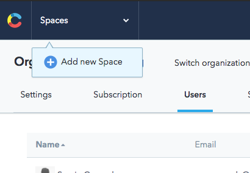
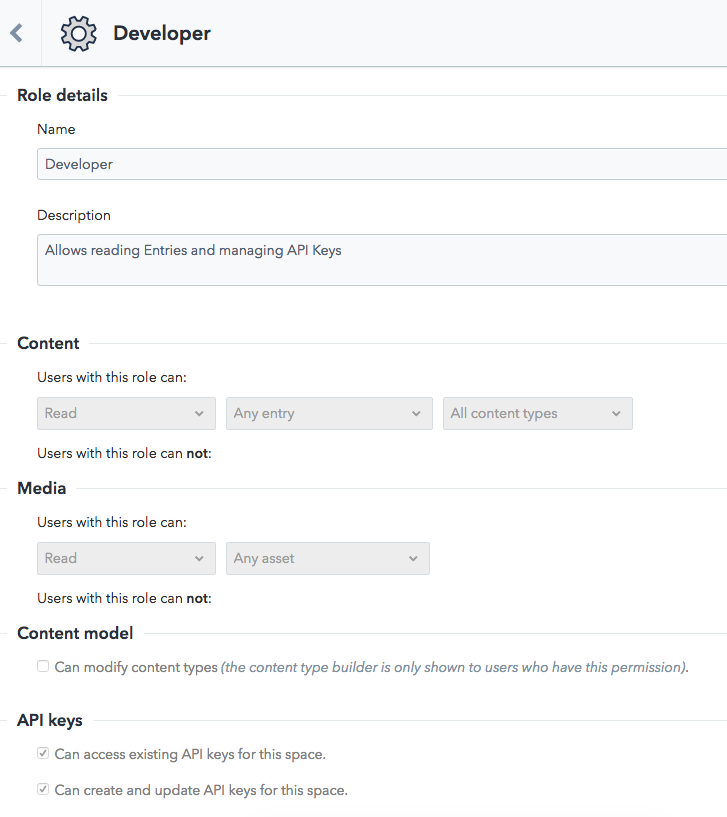
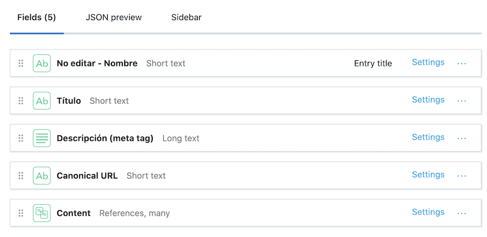
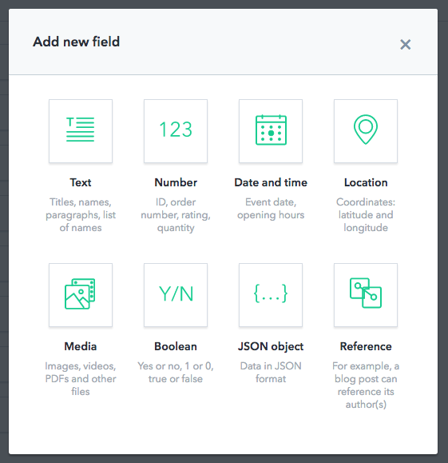
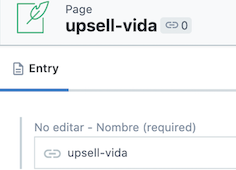

## ¿Qué es Contentful?

Contentful es un poderoso CMS que se encarga de crear, administrar y distribuir todo tipo de contenido. A diferencia de otros CMS, brinda la libertad de crear un modelo propio para que se decida que contenido en específico se quiere administrar.
Tiene varias RESTful APIs para que se pueda enviar el contenido a través de varias plataformas (sitios web, aplicaciones móviles, etc) y cuenta con una interfaz súper interactiva.

### Qué permite hacer Contentful?

- Administrar contenido de todo tipo (texto, imágen, video, booleano, etc.)
- Definir modelos muy específicos, tanto de contenido como de estructura (para los módulos y layotus).
- Tener un modelo flexible, fácil de modificar (por ejemplo, si se quisiera cambiar la posición de un módulo, añadir una descripción, etc).
- Usar componentes reutilizables con Angular.
- Tener una interfaz amigable para evitar errores o confusiones lo más que se pueda a la hora de ingresar el contenido.
- Ser compatible con entornos de producción y desarrollo.

### Primeros pasos

#### Space

El “Space” es el lugar donde se dan de alta los modelos y todo el contenido del proyecto. Se recomienda que se cree un Space por cada proyecto que se tenga en mente.



Contentful permite juntar varios Spaces en “Organizaciones” distintas. Los beneficios es que en cada una se puede tener diferentes planes de suscripción o sistemas de permisos.

#### Sistemas de permisos

Contentful permite construir todo un sistema de permisos como se desea, en este caso se tiene 3 roles de usuario: el developer, el editor y el administrador. 



#### Definición de modelos (Content Type)

El modelo de contenido es el primer paso para estructurar el contenido correctamente. Consiste en crear tipos de contenido que aceptarán sólo ciertos tipos de datos para las publicaciones. Para añadir un nuevo modelo, se crea un **Content Type**. 
>En este ejemplo se genera la estructura que va a tener todas las páginas del sitio web. Como se puede observar, se agrega un contenido de tipo **Content**, el cual permite agrupar plantillas ya preestablecidas.



Cada campo que se va creando puede ser de varios tipos:



#### Agergar Contenido

En este ejemplo, se genera el contenido **Page** en el cual se observan los atributos principales de una página en un sitio web. Como se explica anteriormente, en el tipo content se puede agregar platillas ya definidas. En este caso estas plantillas son componentes que después se vincularán con los componentes de angular. 


#### Administrar el contenido

Ya se tiene los modelos creados y el contenido publicado. El siguiente paso es obtener esa información en el proyecto con sus API’s. Contentful tiene 4 REST API’s para el contenido, cada una con un propósito diferente:
- **Content Delivery API:** Leer el contenido publicado.
- **Content Management API:** Crear o actualizar automáticamente los items (se puede modificar o actualizarlos sin necesidad de entrar a la interfaz).
- **Content Preview API:** Obtener todo el contenido, tanto lo que está publicado como lo que está en edición.
- **Images API:** Obtener y modificar las imágenes guardadas en Contentful.

Anteriormente se explicó que es necesario tener entornos de desarrollo y producción.
> Por medio de estas API’s es posible, ya que en entorno de desarrollo se usa la “Content Preview API” para que acceda al contenido que aún no se publica, mientras que en entorno de producción se usa la “Content Delivery API” donde sólamente trae el contenido que está publicado.

Toda la información llegará en un **JSON**, y las imágenes, videos u otros archivos media llegarán como “archivos”, los cuales están guardados en un CDN.

## Integración con el proyecto

>Es necesario instalar Contentful en el proyecto de Angular.

```bash
$ npm install contentful
```

### Environment

> En la sección de **Settings > API keys** se genera el Token que tendrá la API.

```typescript
  contentful: {
    spaceId: 'afl7xu45le3nr',
    token: 'GpgskCZ3tWd4kZpHA03434lslfkgtin47sk3w98737QpkQ',
  },
```

#### [Más Información](https://www.contentful.com/developers/docs/references/authentication/?utm_source=webapp&utm_medium=knowledge-base-api_key&utm_campaign=in-app-help#the-delivery-and-preview-api)

### Contentful Service

La idea de tener un `service` es poder centralizar las peticiones de la API de Contentful. Sumado al mismo service, poder desarrollar un método `resolver`.

Se desarrolla un resolver porque cuando se navegue a la página donde está el contenido generado por Contentful, es en ese punto donde se tiene que hacer el llamado de la API para obtener todo el contenido que se va a mostrar en el sitio.

Para poder lograr el resultado esperado, en el RouterModule de Angular donde están definidas todas las rutas, se tendra que agregar el resolver a la página de Contentful. Allí se generará un objeto `data` donde se especificará el mismo name que tendrá el contenido creado de tipo `Page` en Contentful.

 

```typescript
const routes: Routes = [
  {
    path: 'upsell-vida',
    component: PageDynamicComponent,
    data: {
      contentful: { name: 'upsell-vida', nameClase: 'page-otros-seguros' },
    },
    resolve: { content: ContentTypeContentResolver },
  },
];

@NgModule({
  imports: [RouterModule.forChild(routes)],
  exports: [RouterModule],
})
export class ContentRoutingModule { }
```
De esta forma se obtiene el objeto data con el nombre del name. Ahora se debe hacer el llamado a la API en el resolver.
Se define el `content_type` que tiene que traer, que en este caso es page. Además se indica el fields al que pertenece, es ahí donde se necesita el name obtenido. De esta manera se adquiere todo el contenido generado mediante Contentful para esa página en particular.

```typescript

@Injectable({
  providedIn: 'root',
})
export class ContentfulService {

  private client = createClient({
    space: environment.contentful.spaceId,
    accessToken: environment.contentful.token,
  });

  constructor() { }

  getContentTypes(name): Promise<Entry<any>> {
    return this.client.getEntries(Object.assign(
      {
        content_type: 'page',
      },
      {
        'fields.name': name,
        include: '10',
      },
    ))
      .then(res => res.items[0]);
  }

}

@Injectable({
  providedIn: 'root',
})
export class ContentTypeContentResolver implements Resolve<any> {
  constructor(private contentfulService: ContentfulService) { }

  async resolve(
    route: ActivatedRouteSnapshot,
    state: RouterStateSnapshot,
  ): Promise<any> {

    let name = route.routeConfig.path;
    if (route.data.contentful) {
      name = route.data.contentful.name;
    }
    const contentTypes = await this.contentfulService.getContentTypes(name);
    return contentTypes;
  }
}
```
### Creación del componente.

Una vez obtenida toda la información de Contentful, es necesario poder mostrarlo en un componente dinámico, ya que es la mejor manera de trabajar con un CMS. A continuación se crea un componente `PageDynamicComponent` donde se renderizará el contendio hacia el cliente.

### Creación de Directiva.

Una de las formas de crear componentes dinámicos en tiempo de ejecución son con directivas, agregando en su constructor el metodo `ViewContainerRef`.

#### DynamicDirective

```typescript
@Directive({
  selector: '[appDynamicHost]',
})
export class DynamicDirective {
  constructor(public viewContainerRef: ViewContainerRef) { }
}
```

#### PageDynamicComponent
```typescript
@Component({
  selector: 'app-page-dynamic',
  template: `
      <div [class]="nameClase">
      <main id="content">
        <ng-template appDynamicHost></ng-template>
      </main>
      </div>
    `,
  styles: [],
})
export class PageDynamicComponent implements OnInit {

  fields: any;
  dataContentful: any;
  nameClase: string;
  @ViewChild(DynamicDirective) dynamicHost: DynamicDirective;

  constructor(
    private dynamicService: DynamicService,
    private route: ActivatedRoute,
  ) {
    this.fields = this.route.snapshot.data.content.fields;
    this.dataContentful = this.route.snapshot.data.contentful;
    this.nameClase = this.dataContentful.nameClase
      ? `${this.dataContentful.nameClase} ${this.dataContentful.name}`
      : this.dataContentful.name;
  }

  ngOnInit() {
    this.renderComponents(this.fields);
  }

  public renderComponents(fields: any) {
    const { content } = fields;
    content.map(item => {
      const type = item.sys.contentType.sys.id;
      const data = item.fields;
      this.dynamicService.loadComponent(type, data, this.dynamicHost);
    });
  }
}
```
Como se puede observar, se llama a un método `renderComponet` en el cual se hace referencia a un servicio `DynamicService`, donde se obtiene toda la lógica para crear el componente.

#### DynamicService

```typescript
@Injectable({
  providedIn: 'root',
})
export class DynamicService {

  constructor(
    private componentFactory: ComponentFactoryResolver,
  ) { }

  private static KNOWN_COMPONENTS = {
    internalHero: HeroInternalComponent,
    itemsList: ListItemsComponent,
    imageOrVideo: ImageVideoComponent,
    horizontalGrid: LegalComponent,
    sideNote: SideNoteComponent,
    subtitleComponent: SubtitleComponent,
    button: ButtonComponent,
    faqListing: FaqListingComponent,
    faq: FaqComponent,
  };

  loadComponent(type: string, data: any, host: DynamicDirective) {

    const componentClass = DynamicService.KNOWN_COMPONENTS[type];
    console.log(componentClass);
    if (!componentClass) {
      return null;
    }

    const componentFactory = this.componentFactory.resolveComponentFactory(componentClass);
    const componentRef = host.viewContainerRef.createComponent(componentFactory);
    (<DynamicComponent>componentRef.instance).data = data;

    return componentRef;
  }

}
```
Se define un objeto statico llamado `KNOWN_COMPONENTS`, donde se vinculan los Content Type de Contentful con los componentes de Angular. Para lograr este comportamiento deseado, cuando se genere un Content Type, se lo tiene que ver como un componente en angular. De esta forma se podrá reutilizar los ContenType en diferentes lugares del sitio web.

En el método `loadComponentet`, se espera obtener el type (nombre content Type), la data (toda la información que contiene esa página), y el host es donde se va a crear el componente.
Se utiliza clave valor para obtener el componente mediante el type.
Por ejemplo, si se tiene el tipo internalHero, va a devolver el HeroInternalComponent. 
El siguiente paso es crear el componente con toda la info, para lo cual se utiliza el componentFactory. Algo a tener en cuenta es que, se emplea la instancia de data para poder igualarlo a la data que viene desde la API. De esa forma, se puede renderizar del mismo orden de como se cargaron en Contentful.
