## Core
- [Authentication](#authentication)
    
- [Http](#http)

- [Utils](#utils)

## Authentication  
- [Directives](#directives)
    - [rbac-allow](#rbac-allow)
- [Guards](#guards)
    - [authentication.guard](#authenticationguard)
    - [authorization.guard](#authorizationguard)
- [Interceptors](#interceptors)
    - [authorization.interceptor](#authorizationinterceptor)
- [Services](#services)
    - [authentication.service](#authenticationservice)
    - [authentication-utils.service](#authentication-utilsservice)
- [Store](#store)
    - [auth.actions](#authactions)
    - [auth.effects](#autheffects)
    - [auth.reducer](#authreducer)

## Directives
### rbac-allow
Permite visualizar partes del template si el usuario se encuentra autorizado para esto (que el usuario este autenticado y tenga el rol para acceder a esa parte del template).

#### Caso de uso

> 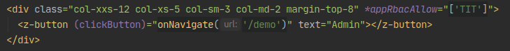

Como vemos en el ejemplo, al definir la directiva `*appRbacAllow="['TIT']"`, estamos indicando que la columna sea renderizada únicamente cuando el rol del usuario sea `TIT` (titular). 

## Guards
### authentication.guard
Esta guarda permite la navegación a ciertas páginas, siempre y cuando estes autenticado.

#### Caso de uso

> 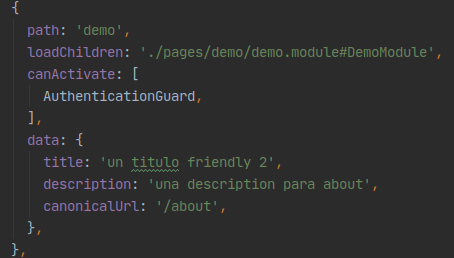

En este ejemplo, en el `app.routing` definimos en `canActivate` la guarda de autenticacion, que nos permitirá navegar a esa ruta si estamos autenticados.

### authorization.guard
Esta guarda nos permite la navegación a ciertas páginas, siempre y cuando este autorizado, de acuerdo al rol que posea el usuario.

#### Caso de uso

> 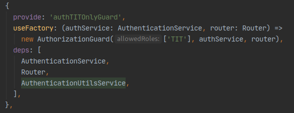

Si inspeccionamos el archivo `authentication.module`, podemos ver que dentro de `providers`, definimos un injection token `authTITOnlyGuard`, que implementa el rol de `TIT`, que luego puede ser utilizado en el `app.routing` de la siguiente forma:

> 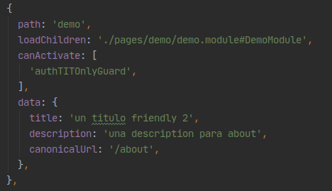

## Interceptors
### authorization.interceptor
Este interceptor, como el nombre lo indica, permite realizar la intercepción de las solicitudes http, y modificar los headers para agregarle el encabezado `Authetincation` con el token correspondiente para que nuestro backend nos pueda reconocer como usuarios.
Además es importante mencionar, que también se agrega el encabezado de `x-global-consumer-id`, el cual debe ser modificado por el nombre o alias correspondiente de su proyecto, para poder obtener la trazabilidad de que proyecto viene la solicitud http.

> 

## Services
### authentication.service
Al usar Auth0, como autenticador y autorizador de nuestras soluciones, hemos implementado el [servicio que sugiere para Angular 2](https://auth0.com/docs/quickstart/spa/angular2), y agregado algunas utilidades, como ser `Redux`, para orquestar el flujo de Login, algunos `Observable` que nos son de utilidad en otros servicios como `rbac-allow.directive`, que nos permiten tener acceso a la data de los roles y usuario.

### authentication-utils.service
Define algunas utilidades para ser utilizadas dentro del flujo de autenticación, como ser el `parseToken`, que nos permite obtener las propiedades que nos trae el token y dos métodos mas, como `pushSignInEvent` y `pushAuthEvent`, que implementan el servicio de GTM y brindan información de cuando nos autenticamos.

## Store
Con el objetivo de brindar otro approach para el manejo del flujo de login (el primero es usar el servicio `authentication.service` directamente), usamos Redux para poder orquestar las acciones. 
### auth.actions
Definimos acciones del flujo de login a ser utilizadas dentro de la aplicación, estas son:
```
    - Login
    - LoginComplete
    - LoginSuccess
    - LoginFailure
    - Logout
```
### auth.reducer
Definimos la función del reductor, y los objetos que brindará cada salida, con el siguiente formato:

> 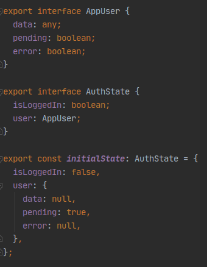

El objeto `AuthState` lo podemos obtener llamando al store mediante la feature `auth`

> 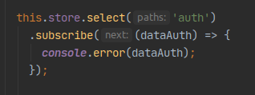

### auth.effects
Hemos definido 3 efectos, las cuales no disparan ninguna acción. Es de consideración saber que dentro de estos efectos se realizan un conjunto de acciones que se detallaran a continuación:
```
    - Login: al dispararse una acción de este tipo, llama al método login del servicio de auth.service
    - Logout: llama al método logout del servicio de auth.service
    - LoginSuccess: llama a los métodos pushSignInEvent y pushAuthEvent del servicio de auth-utils.service
```
Sientase libre de poder utilizar estos efectos y agregarle lógica, para este tipo de acciones.


## Http  
  - [error.interceptor](#errorinterceptor)
  - [http.service](#httpservice)
  - [timing.interceptor](#timinginterceptor)

### error.interceptor
Este interceptor tomá la respuesta que devuelve el backend, y si la respuesta es un error, pasa por un handler.

### timing.interceptor
Timing interceptor permite obtener la duración total de la solicitud http, desde que sale del front, hasta que devuelve una respuesta backend.

### http.service
Este servicio permite la creación, importación y eliminación dinámica de interceptores. Si podemos visualizar, por defecto los templates de GoldenFront define 3 interceptores:
> 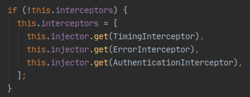
 
 Nota: es ideal que si agregan interceptores, sean agregados en este lugar.
 Nota 2: Es `IMPORTANTE` no importar de nuevo `HttpClient`, en tu proyecto debería estar importado unicamente en `core.module`, sino pueden existir efectos adversos. [ACÁ EL PORQUE](https://dev.to/devakone/angular-when-httpinterceptor-doesn-t-work-with-lazy-loaded-modules-3ipg)
 
 > 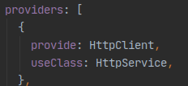


## Utils
### Services
Hemos definido unos servicios como base que intentan brindar ayuda en cuestiones como inyección de scripts, manejo de acciones con GTM, wrappeo de objetos y métodos globales tanto del lado del browser como del server usando Server Side Rendering.

Para comenzar, tenemos un set de servicios que nos dan una serie de utilidades en general:
- [logger.service](#loggerservice)
- [script-loader.service](#script-loaderservice)
- [seo-base.service](#seo-baseservice)
- [seo-gtm.service](#seo-gtmservice)

### logger.service
Como el nombre lo indica, el servicio nos ayuda a loggear mensajes en la consola, es utilizada en `TimingInterceptor` por ejemplo.

### script-loader.service
Con el objetivo de mejorar la primera carga de la página y una insersión ordenada de scripts, ScriptLoaderService nos permite la inyección de scripts mediante el uso de `Observable`. 

El servicio brinda una interfaz para el cargado de un script:

> 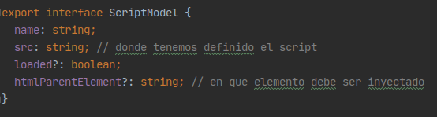

Caso de uso

> 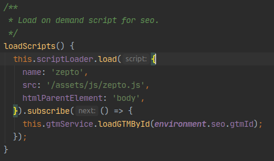

Por defecto el script tiene seteado `htmlParentElement` en `body`, por ende no sería necesario enviarle esta propiedad, excepto que quieras que el script quieras cargarlo sobre otro elemento (deberias tener un buen porque de porque querés hacer eso).

Este sería un ejemplo de como inyectar multiples scripts de forma secuencial:
> 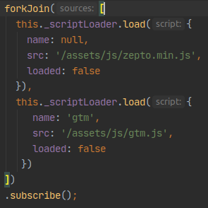

### seo-base.service
Con el objetivo de poder hacer mas amigable la integración con SEO, definimos este servicio que nos brinda ayuda con esto. En grandes rasgos este nos ayuda a la definición de tags como `title`, `meta` y definición de `url canonicas` por cada página de nuesta aplicación en forma dinámica.

El funcionamiento se basa en si en el uso del `Router` de Angular, definiendo por cada ruta correspondiente los datos necesarios como párametros.

Caso de uso:

Dentro del `app.routing` para cada ruta si es necesario definimos:

> 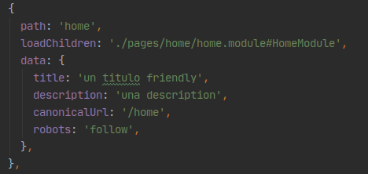

### seo-gtm.service
Este servicio permite acceder a funciones del Google Tag Manager, de forma tal que su uso sea mucho más simple.
Posee los siguientes métodos:
```
    loadGTMById(gtmId); // carga el gtm
    pushToDataLayer(dataLayer); // guarda datos en el data layer
    clean(); // limpia el data layer
    encryptData(data); // encripta datos para guardar en el data layer
    decryptData(data); // desencripta datos para guardar en el data layer
```

La forma correcta de poder cargar el GTM, es primero poder cargar la librería de `zepto`, que es una librería que permite a la gente de analítica realizar acciones en la sesión de cada usuario.
> 

La forma correcta de poder pushear data al `datalayer` es:
> 


## Wrappers Server
Recordemos que cuando utilizamos Angular Universal, del lado del server no tenemos representación del DOM, por ende brindamos unos servicios del tipo wrapper que nos ayudan a poder acceder a las funciones que nos brinda el DOM.
- [document.service](#documentservice)
- [domino-helper.service](#domino-helperservice)
- [local-storage-wrapper.service](#local-storage-wrapperservice)
- [window.service](#windowservice)
- [navigator.service](#navigatorservice)
### document.service
Este servicio wrappea el objeto document, difiriendo de acuerdo si estamos en el browser o en el server.
### domino-helper.service
TODO
### local-storage-wrapper.service
Este servicio wrappea el objeto localstorage, difiriendo de acuerdo si estamos en el browser o en el server.
### window.service
Este servicio wrappea el objeto window, difiriendo de acuerdo si estamos en el browser o en el server.

NOTA: Es importante tener en cuenta que los métodos que utilices de document, window o localstorage tenes que agregarlos para que funcionen del lado del server y además testearlo, caso contrario se puede explotar la representación del lado del servidor.

### navigator.service
Navigator Service permite obtener información de donde estamos parados, es decir nos permite saber sobre que dispositivo se ejecuta nuestra aplicación o simplemente si lo que queremos ejecutar queremos que se haga unicamente del lado del servidor o del lado del cliente.

```
get isMobile(): boolean
get isGoogleBot(): boolean // permite saber si un robot de Google o otro dispositivo esta leyendo nuestro código.
get isBrowser(): boolean
get isServer(): boolean
```
