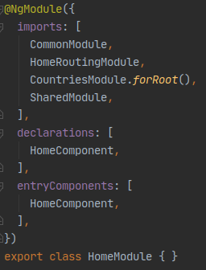
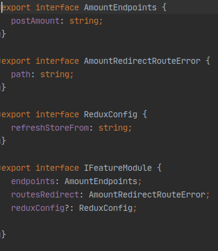
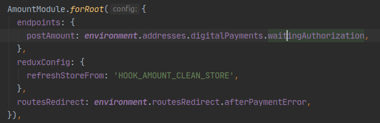
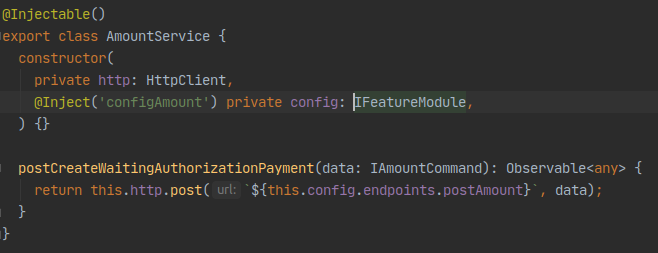

## Pages y Features
Para entender un poco la idea del porque modularizamos con la idea de pages, features y shared, recomendamos leer el siguiente artículo [Architecture in Angular projects](https://medium.com/@cyrilletuzi/architecture-in-angular-projects-242606567e40), el cuál explica en general las motivaciones del porque de la arquitecutra.

Nuestro template armado respeta esta idea, la cuál pasaremos a explicar un poco como esta estructurado:

- [Pages Module](#pages-module)
    
- [Features Module](#features-module)

## Pages Module
La idea es que estos tipos de módulos casi siempre sean de carga diferidas, definiendo su importación de forma lazy en el `app.routing`.
>  

El módulo presentado arriba, sería mas o menos un módelo comun que podría presentar un `Page Module`. Teniendo declarado todos los componentes desarrollados dentro del módulo y importadas todas sus dependencias externas, como ser el propio `router del módulo`, `SharedModule` y sus `Features Modules`. 

## Features Module
La idea de tener un `Feature Module` es poder lograr reutilizarlo en otras páginas y en otros proyectos inclusive, con un bajo acoplamiento y buen manejo de las dependencias.

>  

Un módulo Feature es armado de forma estandar como se muestra arriba, usando Redux para la orquestación de una solicitud Http, depositando asi los datos resultantes de la solicitud en el store. Además proveemos datos externos atraves del método `forRoot()` mandandole todas las configuraciones necesarias para el funcionamiento del módulo, como por ejemplo los endpoints disponibles.

Uso de las configuraciones inyectadas del módulo como `Injection Token`:

Las configuraciones que fueron enviadas por parámetro via forRoot podemos definirlas como interface para establecer un contrato, para luego utilizarlas en otras partes del módulo.

Podemos definir las propiedades del objeto config que tendrá el módulo de la siguiente forma:
>  

Al importar el módulo Feature en el módulo Page, llamamos a su método `forRoot` pasando como parámetro el objeto config definido.

>  

Podemos utilizar el objeto config atraves de un `InjectionToken` de la siguiente manera:
>  
### Consideraciones NgRx por feature
La idea de estos módulos tipo feature es que su funcionalidad este orientada al desarrollo basados en solicitudes http, siendo esto asi, podemos decir que lo recomendado es utilizar este esquema propuesto para el desarrollo de funcionalidades de este tipo, no quitando asi la imaginación, magia y buenas prácticas de cada desarrollador si creen necesario que su funcionalidad tenga asociado otro `reducer` con `actions` y nuevos `effects` asociados; como asi tambien de quitar Redux de no creer necesario tener Redux en una Feature.

