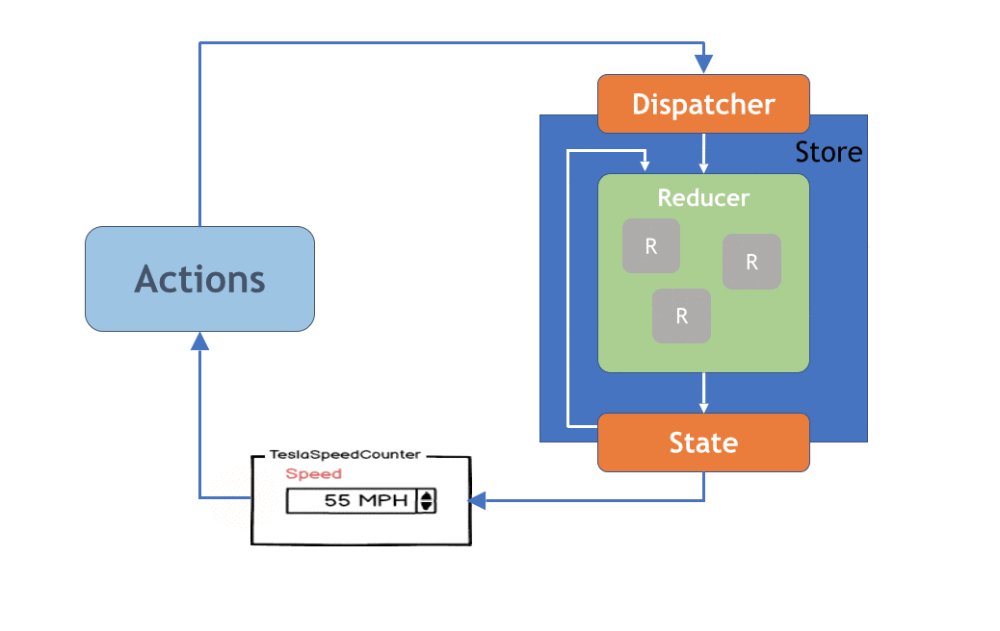

## Redux

Redux es una herramienta para la gestión de estado en aplicaciones web que nació en 2015 de la mano de @dan_abramov.
Es una librería agnóstica al framework, en nuestro caso (angular 6) usamos ngrx.

### ¿Qué es la gestión de estado?
En programación, se podría definir **“estado”** como el *conjunto de todos los valores almacenados por la aplicación mediante propiedades o variables* en cualquier momento de ejecución.

La gestión de estado **consiste en asegurar que la UI muestre correctamente el estado actual de la aplicación y es un pilar fundamental en frontend**.

### Cuándo utilizar redux
Las aplicaciones sencillas no necesitan darle demasiada importancia a la gestión del estado, su estado se puede almacenar directamente en las propiedades de los componentes, por ejemplo.

Sin embargo la **gestión de estados aparece cuando la aplicación comienza a crecer**. Será necesario cuando se tiene una app tan grande que en un momento dado se pierde el control del cuándo, cómo y por qué del estado.

### El propósito de Redux
*Es hacer predecibles los cambios de estado*, imponiendo ciertas restricciones sobre cómo y cuándo pueden producirse las actualizaciones. Redux consigue que la gestión de estado sea transparente y determinista, lo que entre otras cosas aporta…
-   Mejorar la comprensión de la evolución del estado en un momento dado
-   Facilidad para incorporar nuevas características a la app
-   Un nuevo abanico de herramientas de debugging (como el time travelling)
-   Capacidad de reproducir un bug
-   Mejoras en el proceso de desarrollo, pudiendo reiniciar la ejecución a partir de un estado concreto.

### Redux en Angular
**En Angular**, la forma habitual de **almacenar el estado es a través de servicios**, que son *objetos singleton* a los que se puede acceder cualquier componente mediante la inyección de dependencias.
Esta diferencia hace que **en Angular __no sea tan necesario el uso de Redux__, hasta que la aplicación no se vuelve realmente grande**.

### Los principios fundamentales de Redux
-   **Fuente única de verdad**: En Redux hay un único objeto que almacena el estado de toda la aplicación
-   **Inmutabilidad, el estado es read-only**. Ninguna interacción puede cambiarlo directamente. Lo único que se puede hacer para conseguirlo, es emitir una acción que expresa su intención de cambiarlo.
-   **Funciones puras**: Usa funciones puras (a mismos inputs, mismos outputs) para definir como cambia el estado en base a una acción. En Redux estas funciones se conocen como reducers y al ser puras, su comportamiento es predecible.

### Angular clásico vs Angular con Redux

### Arquitectura Redux
Existen elementos fundamentales en Redux que se debe entender desde el principio para poder desarrollar.

- **Store**: Contiene el estado de la aplicación (ver: https://es.redux.js.org/docs/basico/store.html)

- **Acción**: es un bloque de información que envia datos desde tu aplicación a tu store. Son objetos simples que incluyen una propiedad type y pueden incluir otros campos con información adicional, por convención se le llama payload.

- **Reducer**: devuelven un nuevo estado, probablemente modificado en base a la acción. Son funciones que definen cómo debe cambiar el estado de la aplicación en respuesta a las acciones.(https://es.redux.js.org/docs/basico/reducers.html)

- **Selector** Son funciones de tipos memoized, se usan de forma buffers para evitar recalcular un cómputo que se haya producido con anterioridad

- **Efecto** Se usan para orquestar acciones y tomar desiciones, orientar flujos de trabajo, extremadamente fundamental.

### Diagrama de ejecución
fuente: https://gyver98.github.io/blog/development/react/2017/03/20/redux-tesla-battery-range-calculator-part2-english/

