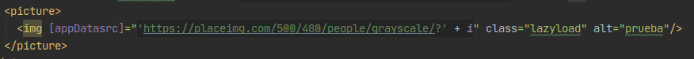
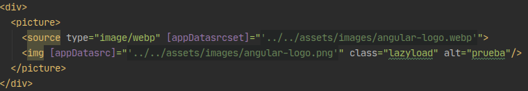
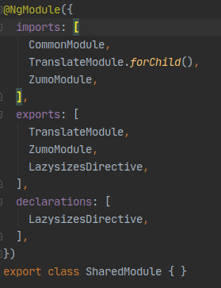
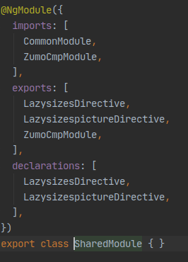
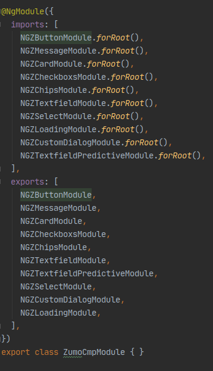

## Core
- [Directives](#directives)
    
- [I18n](#i18n)

- [Module](#module)

- [Optimizaciones para Zumito](#optimizaciones-para-zumo)

## Directives  
- [Lazysizes](#lazysizes)
- [LazysizesPicture](#lazysizespicture)

### Lazysizes
Esta directiva permite la carga diferida de imágenes, cargando unicamente la imagen cuando esta se encuentra dentro del viewport.

Caso de uso:

> 

Nota: es importante usar la clase lazyload, sino la carga diferida no va a funcionar y va a cargar la imagen.

### LazysizesPicture
Esta directiva permite agregar el srcset con formato webp a un tag source.

En sintesis, esto sirve para casos en que uno usa la etiqueta `<picture>` en el html, esta etiqueta  brinda a los desarrolladores web más flexibilidad para especificar recursos de imágenes. `<picture>` contiene dos etiquetas diferentes: una o más etiquetas `<source>` y una etiqueta ``. Basicamente configura diferentes fuentes, y la primera fuente que se ajusta a las preferencias es la que se utilizará. Más info en [w3school](https://www.w3schools.com/tags/tag_picture.asp).

Caso de uso:

> 

Si podemos visualizar, este ejemplo se encuentra en el template, sobre el módulo Demo, si podemos ver, la etiqueta `source` apunta a una imagen con extensión webp y la etiqueta `img` a una .png respectivamente, si ejecutamos el proyecto y vamos hacia esa página, si observamos con `devtools` en la pestaña de `network`, el recurso que va a buscar es la imagen webp.

## I18n
Para la internacionalización hemos utilizado la librería `@ngx-translate`, junto a unas customizaciones realizadas con el objetivo de mejorar la experiencia de las traducciones tanto en modo server como en browser.

Cuando trabajamos con Angular Universal, un tema de rendimiento importante es el primer pintado, por ende es importante mencionar que el cargado de las traducciones viene dado por un archivo `.json`, el cual es llamado via http por la librería `@ngx-translate/http-loader` para que posteriormente, luego de que el archivo este en el browser, se carguen las traducciones definidas en una página. Por lo tanto nos parecio necesario poder evitar el cargado de este archivo del lado del browser, poder realizarlo en el lado del server y transferirselo finalmente al browser, y esto fue posible gracias a la magia del servicio de `TransferState`

- [i18n.service](#i18n-service)
- [i18n-browser.module](#i18n-browser-module)
- [i18n-server.module](#i18n-server-module)

### I18n Service
Brinda servicio a los módulos i18n browser y server, basicamente permite la inicialización del módulo que nos brinda `@ngx-translate` como asi tambien la definición del lenguaje.

### I18n Browser Module
Este módulo nos permite inicializar la internacionalización del lado del browser, tomando el estado (osea todo el objeto `.json` de traducciones si es que lo pudo cargar) del server. 
Es importante que en `app.module` se importe este modulo junto con su servicio.
### I18n Server Module
Este módulo nos permite inicializar la internacionalización del lado del server. Basicamente, si es que puede, realiza la llamada http del archivo `.json` de traducciones y las guarda usando el servicio `TransferState` para que luego el browser pueda consultarlo.
Es importante que en `app.server.module` se importe este modulo junto con su servicio.

## Module

> 

Es importante mencionar, que según la teoría, `SharedModule` debería estar importado para ser usados en las features o pages, NO EN EL `app.module`.
`TranslateModule` es importado y exportado para que las traducciones funcionen en la página o feature que importe shared, al igual que ZumoModule.

## Optimizaciones para Zumo

Una caracteristica secreta de Zumo, es que podes importar individualmente los componentes que usas y no todo el design system completo, lo cual ahorra un par de kb de chunks al momento de buildeo. La estrategia adoptada es generar un módulo donde solo importemos `UNICAMENTE` los componentes de Zumo que utilizamos, y importar dicho módulo en shared para que todos tengan acceso.

> 

> 
